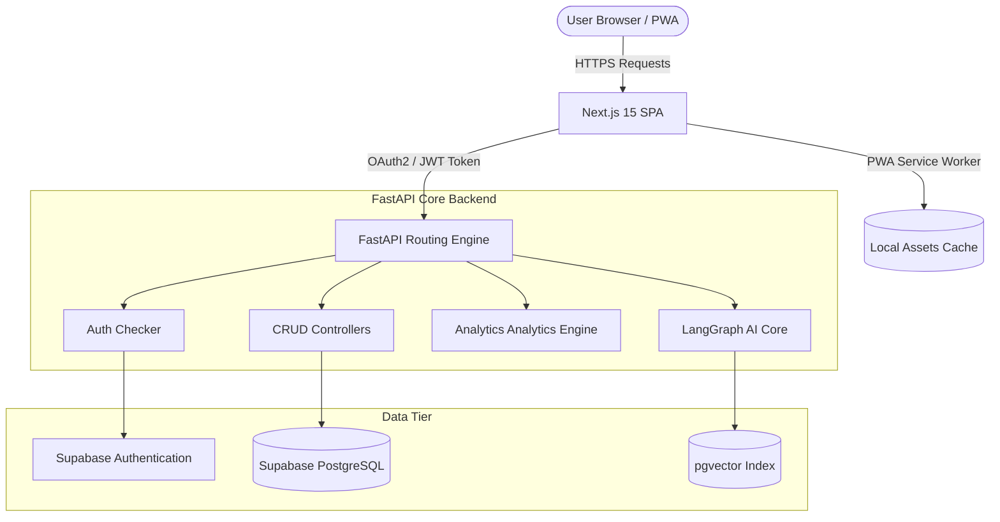
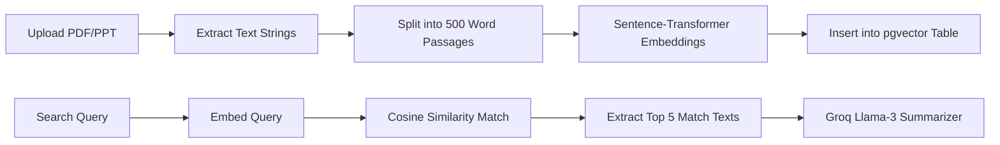

# System Architecture & Design

This document details the software architecture, database relations, and workflow charts of the **LPU HRDC Nexus** platform.

---

## 1. System Components Architecture

The application is structured as a cloud-native Progressive Web App:



---

## 2. Entity Relationship Diagram (ERD)

The database matches standard Relational schemas with custom pgvector columns:

```mermaid
erDiagram
    USERS {
        string id PK
        string email UNIQUE
        string hashed_password
        string full_name
        string role
        string department
        datetime created_at
    }
    PROGRAMS {
        int id PK
        string title
        string description
        string category
        string mode
        string venue
        datetime start_date
        datetime end_date
        int max_capacity
        string status
    }
    SESSIONS {
        int id PK
        int program_id FK
        int session_number
        string topic
        datetime start_time
        datetime end_time
        string venue
        string trainer_id FK
    }
    ENROLLMENTS {
        int id PK
        int program_id FK
        string user_id FK
        string status
        datetime enrolled_at
    }
    ATTENDANCE {
        int id PK
        int session_id FK
        string user_id FK
        datetime marked_at
        string status
        string verification_method
        float latitude
        float longitude
    }
    DOCUMENTS {
        int id PK
        int program_id FK
        int session_id FK
        string title
        string file_url
        string file_type
        datetime uploaded_at
    }
    DOCUMENT_CHUNKS {
        int id PK
        int document_id FK
        string text_content
        vector embedding
    }

    USERS ||--o{ ENROLLMENTS : registers
    USERS ||--o{ ATTENDANCE : clocks_in
    PROGRAMS ||--o{ SESSIONS : schedules
    PROGRAMS ||--o{ ENROLLMENTS : manages
    SESSIONS ||--o{ ATTENDANCE : logs
    PROGRAMS ||--o{ DOCUMENTS : slides
    DOCUMENTS ||--o{ DOCUMENT_CHUNKS : splits
```

---

## 3. LangGraph Workflow Flowchart

The AI Assistant routes questions dynamically through a sequence of checkers and validators:

```mermaid
graph TD
    QueryInput([User Query]) --> Classify[Intent Classification Agent]
    
    Classify -->|attendance| AttAgent[Attendance Agent]
    Classify -->|program| ProgAgent[Programme Retrieval Agent]
    Classify -->|rag| RAGAgent[Document Retrieval Agent (RAG)]
    Classify -->|analytics| StatsAgent[Analytics Agent]
    Classify -->|general| ChatAgent[General Conversation Agent]
    
    AttAgent --> Report[Report Generation Agent]
    ProgAgent --> Report
    RAGAgent --> Report
    StatsAgent --> Report
    ChatAgent --> Report
    
    Report --> Validate[Response Validation Agent]
    Validate -->|Valid Facts| ResponseOutput([Final Verified Output])
    Validate -->|Hallucinations| AuditWarning[Append Fact Verification Warning] --> ResponseOutput
```

---

## 4. RAG Architecture Pipeline


